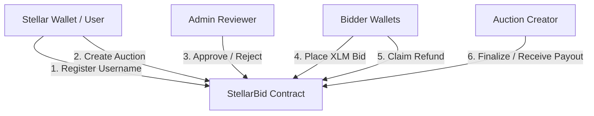

# StellarBid

StellarBid is a decentralized, real-time auction platform built on the **Stellar Soroban** smart contract framework and a fast, modern **React + Vite + TypeScript + Tailwind CSS** frontend. 

Features:
- **Permanent On-Chain Identity**: Users claim a unique, immutable username mapped directly to their Stellar wallet address.
- **Admin-Reviewed Auctions**: Newly created auctions enter a `Pending` state, visible only to the reviewer. The reviewer approves or rejects them from a dedicated dashboard.
- **Native XLM Escrow**: All bids are held securely by the smart contract in escrow.
- **Cumulative Bidding**: Bidders can increase their bids incrementally; the contract tracks and displays their cumulative total deposit.
- **Instant Payout & Refunds**: The winning bid's escrow is sent directly to the creator on finalization. Losing bidders claim their full escrow back instantly.
- **Real-Time Updates**: UI state is kept in sync using background event polling on the Soroban RPC.

---

## Technical Architecture



### 1. Smart Contract Storage Design
- **Instance Storage**: Keeps small, configuration-level values updated on every call (`Admin` address, native token `TokenId`, and total `AuctionCount`).
- **Persistent Storage**: Holds long-lived registry records (`Username`, `UsernameExists` for uniqueness, `Auction` data structures, and the per-bidder cumulative `BidDeposit`).

### 2. Event Dispatching
The contract emits specialized, lightweight events on state changes:
- `user_registered` (topic: `user register`)
- `auction_created` (topic: `auction created`)
- `auction_approved` (topic: `auction approved`)
- `auction_rejected` (topic: `auction rejected`)
- `bid_placed` (topic: `bid placed`)
- `auction_finalized` (topic: `auction ended`)
- `refund_claimed` (topic: `refund claimed`)

---

## Directory Structure

```
stellarBid/
├── contracts/
│   └── auction/          # Soroban Rust smart contract
│       ├── src/
│       │   ├── lib.rs     # Main contract logic & error codes
│       │   ├── types.rs   # Data types (AuctionData, AuctionStatus)
│       │   ├── storage.rs # Storage key definitions
│       │   ├── events.rs  # Event emitting module
│       │   └── test.rs    # Complete unit test suite (19 tests)
│       └── Cargo.toml
├── frontend/             # React SPA Frontend
│   ├── src/
│   │   ├── components/   # UI & Layout components
│   │   ├── context/      # Wallet & Toast state providers
│   │   ├── pages/        # Explore, Detail, Create, Admin & Profile pages
│   │   ├── services/     # Soroban RPC client, Event Poller, Wallet wrapper
│   │   ├── types/        # TypeScript type interfaces
│   │   └── utils/        # Constants, formatters, and contract error maps
│   ├── tailwind.config.js
│   └── vite.config.ts
└── README.md             # Project documentation (this file)
```

---

## Build & Test Instructions

### Smart Contract (Soroban Rust)

1. **Prerequisites**:
   Ensure you have Rust, WASM target, and the Stellar CLI installed:
   ```bash
   rustup target add wasm32-unknown-unknown
   cargo install --locked stellar-cli
   ```

2. **Run Tests**:
   Execute the suite of 19 scenario-based unit tests:
   ```bash
   cargo test
   ```

3. **Build WASM Binary**:
   Compile and optimize the contract bytecode:
   ```bash
   stellar contract build
   ```
   The optimized WASM will be located at `target/wasm32v1-none/release/stellar_bid_auction.wasm`.

---

### Web Frontend (React + TS + Tailwind CSS)

1. **Install Dependencies**:
   ```bash
   cd frontend
   npm install
   ```

2. **Development Mode**:
   Launch the local dev server:
   ```bash
   npm run dev
   ```

3. **Production Build**:
   Compile TypeScript and bundle assets for distribution:
   ```bash
   npm run build
   ```

---

## Configuration & Deployment Settings

### Constants
All core configurations are managed in [constants.ts](file:///c:/Users/SBR/Desktop/Stellar/stellarBid/frontend/src/utils/constants.ts):
- `CONTRACT_ID`: The deployed contract ID on testnet.
- `ADMIN_ADDRESS`: The designated reviewer wallet.
- `RPC_URL`: The RPC node server URL (`https://soroban-testnet.stellar.org`).
- `NETWORK_PASSPHRASE`: The Testnet network passphrase.

### IPFS Integration
Auction media inputs support direct IPFS URLs (`ipfs://Qm...`). The frontend automatically resolves these using a public IPFS gateway:
- Raw link: `ipfs://QmXoypizjW3Wkn2Mc2SqJaPugEXPm1GalkHQmsjaQnvX54`
- Resolved link: `https://ipfs.io/ipfs/QmXoypizjW3Wkn2Resm1GalkHQmsjaQnvX54`

---

## Design System

The frontend utilizes a customized, highly premium **Dark Theme** designed with Tailwind CSS:
- **Glassmorphism**: Transparent cards (`rgba(18, 20, 32, 0.65)`) with backdrop blur (`blur-xl`), subtle borders, and smooth shadows.
- **Accents**: Indigo (`#6366f1`), Royal Purple (`#8b5cf6`), Emerald Green for bids, Amber for counts, and Cyan for success badges.
- **Fonts**: **Plus Jakarta Sans** for smooth, modern headings and interfaces, coupled with monospace font styling for crypto addresses and hashes.
