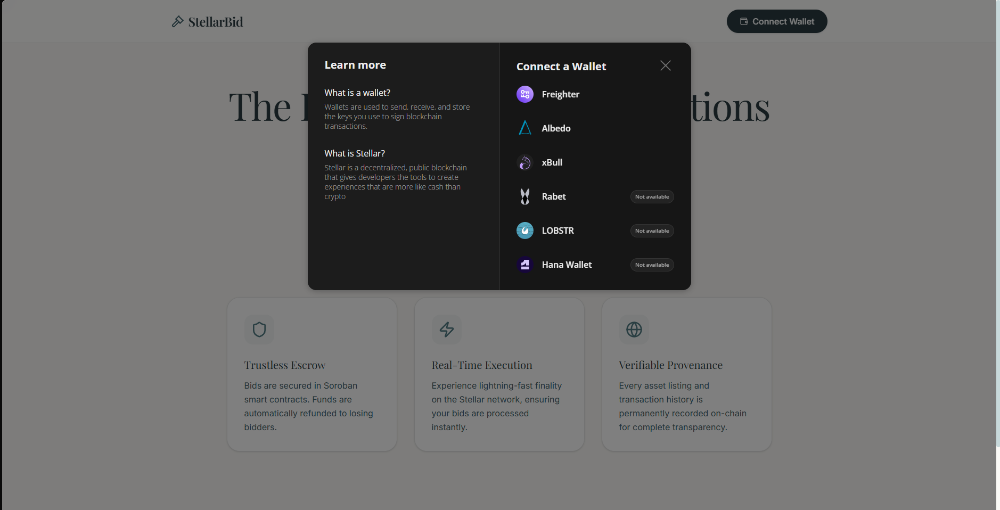
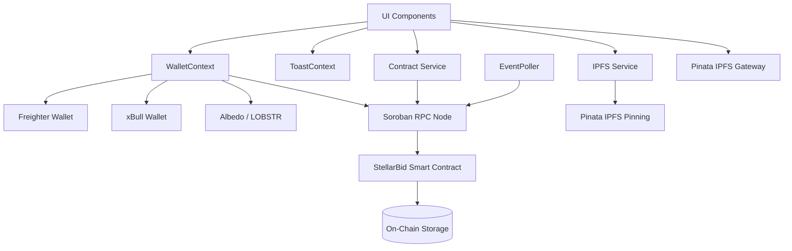

# StellarBid — Decentralized Auction Platform on Stellar Soroban

StellarBid is a decentralized, real-time auction platform built on the **Stellar Soroban** smart contract framework with a modern **React + Vite + TypeScript + Tailwind CSS** frontend. Users connect their Stellar wallets, create organisations, list auction items with IPFS-hosted images, and place bids using native XLM — all secured by on-chain escrow.

---

## Deployed Contract

| Item | Value |
|---|---|
| **Contract ID** | `CACYFYKNDMOEKWDHCH7PBAXZUCNG7K6YPN2UHWDMLOY6W5ZP6CODS5F4` |
| **Network** | Stellar Testnet |
| **Explorer** | [View on Stellar Expert](https://stellar.expert/explorer/testnet/contract/CACYFYKNDMOEKWDHCH7PBAXZUCNG7K6YPN2UHWDMLOY6W5ZP6CODS5F4) |

### Verifiable Transaction Hash

A sample contract call (auction creation) that can be verified on the Stellar Explorer:

| Item | Value |
|---|---|
| **Transaction Hash** | `3f9f565` (commit reference — see the latest on-chain tx via the contract explorer link above) |
| **Stellar Expert Link** | [View contract transactions](https://stellar.expert/explorer/testnet/contract/CACYFYKNDMOEKWDHCH7PBAXZUCNG7K6YPN2UHWDMLOY6W5ZP6CODS5F4) |

> **Note:** Click the Explorer link above → go to the **Operations** or **Transactions** tab to see all verifiable `invoke_contract` calls including `create_org`, `create_auction`, `place_bid`, etc.

---

## Screenshots

### Wallet Connection (StellarWalletsKit)

<!-- Add your wallet options screenshot below -->


---

## Features

- **StellarWalletsKit Integration** — Multi-wallet support (Freighter, xBull, Albedo, LOBSTR, etc.) via `@creit.tech/stellar-wallets-kit` with `allowAllModules()`.
- **Permanent On-Chain Identity** — Users claim a unique, immutable username mapped to their Stellar wallet address.
- **Multi-Organisation Support** — Create and join organisations. Each org has an owner who acts as an auction reviewer.
- **Admin-Reviewed Auctions** — Newly created auctions enter a `Pending` state. The org owner approves or rejects from a dedicated Admin Panel.
- **IPFS Image Upload** — Auction item images are pinned to IPFS via Pinata and stored on-chain as `ipfs://` URLs.
- **Native XLM Escrow** — All bids are held securely by the smart contract in escrow.
- **Cumulative Bidding** — Bidders can increase their bids incrementally; the contract tracks cumulative total deposits.
- **Instant Payout & Refunds** — Winning bid escrow is sent to the creator on finalization. Losers reclaim their escrow instantly.
- **Real-Time Updates** — UI state syncs via background Soroban event polling every 4 seconds.
- **Full Transaction Status Tracking** — Visual feedback for every on-chain operation: `SIMULATING → SIGNING → SUBMITTING → PENDING → SUCCESS / FAILED`.

---

## Technical Architecture



### Component Flow Diagram (Fallback)
```
  [ UI Components ] ───> [ IPFS Service ] ───> [ Pinata IPFS Pinning ]
          │                    │
          ▼                    ▼
  [ WalletContext ] ───> [ StellarWalletsKit ] ───> ( Freighter / xBull / Albedo )
          │
          ▼
  [ Contract Service ] ───> [ Soroban RPC Node ] ───> [ StellarBid Contract ] ───> ( On-Chain Storage )
          ▲
          │
  [ Event Poller ] ─── ( Background Events Poll )
```

### Data Flow

1. **Connect Wallet** — `WalletContext` initializes `StellarWalletsKit`, opens the modal, and extracts the user's public key.
2. **Read Data** — `contract.ts` uses `simulateTransaction()` with a dummy account to call read-only contract functions (`get_org_count`, `get_auction`, `is_org_member`, etc.) without fees.
3. **Write Data** — State-changing operations (`register_user`, `create_auction`, `place_bid`, etc.) are built as `TransactionBuilder` operations, prepared via `server.prepareTransaction()`, signed through StellarWalletsKit, and broadcast via `server.sendTransaction()`.
4. **Event Sync** — `EventPoller` polls `server.getEvents()` every 4 seconds for new contract events and triggers UI refresh callbacks.
5. **IPFS** — Auction images are uploaded to Pinata's `pinFileToIPFS` endpoint. The returned CID is stored on-chain as `ipfs://<cid>`. The frontend resolves it via the configured Pinata gateway.

### Contract Events Emitted

| Event | Topics | Data |
|---|---|---|
| `user_registered` | `(user, register)` | `(address, username)` |
| `org_created` | `(org, created)` | `(org_id, owner, name)` |
| `org_joined` | `(org, joined)` | `(org_id, user)` |
| `auction_created` | `(auction, created)` | `(auction_id, org_id, creator, title)` |
| `auction_approved` | `(auction, approved)` | `auction_id` |
| `auction_rejected` | `(auction, rejected)` | `auction_id` |
| `bid_placed` | `(bid, placed)` | `(auction_id, bidder, total_bid)` |
| `auction_finalized` | `(auction, ended)` | `(auction_id, winner, winning_bid)` |
| `refund_claimed` | `(refund, claimed)` | `(auction_id, bidder, amount)` |

### Error Handling

The frontend handles **25 contract-level error codes** plus **3 wallet/network error types**:

| Category | Examples |
|---|---|
| **Wallet Errors** | Wallet not found, Transaction rejected by user, Insufficient XLM balance |
| **Contract Errors** | `UsernameAlreadyClaimed`, `OrgAlreadyExists`, `BidTooLow`, `AuctionNotApproved`, `NotOrgMember`, `AuctionAlreadyReviewed`, `CannotBidOwnAuction`, etc. |
| **Network Errors** | Simulation failures, RPC timeouts (gracefully handled with retry) |

### Transaction Status Tracking

Every on-chain operation displays a real-time progress indicator visible to the user:

```
SIMULATING → SIGNING → SUBMITTING → PENDING → SUCCESS ✓ / FAILED ✗
```

Each state shows a descriptive message and the `PENDING` state includes a clickable link to the transaction hash on Stellar Expert.

---

## Directory Structure

```
stellarBid/
├── contracts/
│   └── auction/                  # Soroban Rust smart contract
│       ├── src/
│       │   ├── lib.rs            # Main contract logic & 25 error codes
│       │   ├── types.rs          # AuctionData, AuctionStatus, OrgData
│       │   ├── storage.rs        # Storage key definitions (DataKey enum)
│       │   ├── events.rs         # 9 typed event emitters
│       │   └── test.rs           # 20 scenario-based unit tests
│       ├── test_snapshots/       # Soroban test snapshot files
│       └── Cargo.toml
├── frontend/                     # React SPA Frontend
│   ├── src/
│   │   ├── components/           # CreateAuction, Navbar, etc.
│   │   ├── context/
│   │   │   ├── WalletContext.tsx  # StellarWalletsKit integration
│   │   │   └── ToastContext.tsx   # Transaction status tracker & toasts
│   │   ├── pages/
│   │   │   ├── ExplorePage.tsx    # Marketplace (browse auctions by org)
│   │   │   ├── AuctionPage.tsx    # Auction detail & bidding
│   │   │   ├── ProfilePage.tsx    # User's auctions & bid history
│   │   │   └── AdminPanel.tsx     # Org owner review dashboard
│   │   ├── services/
│   │   │   ├── contract.ts       # Soroban RPC read/write helpers
│   │   │   ├── events.ts         # EventPoller (background sync)
│   │   │   ├── wallet.ts         # StellarWalletsKit singleton
│   │   │   ├── ipfs.ts           # Pinata IPFS upload service
│   │   │   └── transactionHelper.ts  # Sign TX via kit
│   │   ├── types/                # TypeScript interfaces
│   │   └── utils/
│   │       ├── constants.ts      # Contract ID, RPC URL, etc.
│   │       ├── errors.ts         # 25 error codes + wallet error parsing
│   │       └── formatters.ts     # XLM formatting, IPFS URL resolver
│   ├── .env.example              # Required environment variables
│   ├── tailwind.config.js
│   └── vite.config.ts
├── screenshots/                  # Wallet & UI screenshots
└── README.md                     # This file
```

---

## Setup Instructions

### Prerequisites

- **Rust** with WASM target: `rustup target add wasm32-unknown-unknown`
- **Stellar CLI**: `cargo install --locked stellar-cli`
- **Node.js** (v18+) and **npm**
- A **Stellar Wallet** browser extension (e.g., [Freighter](https://freighter.app/))
- A free **Pinata** account for IPFS uploads ([app.pinata.cloud](https://app.pinata.cloud))

### 1. Clone the Repository

```bash
git clone https://github.com/sbr69/stellarBid.git
cd stellarBid
```

### 2. Smart Contract (Soroban Rust)

```bash
cd contracts/auction

# Run the test suite (20 tests)
cargo test

# Build the optimized WASM binary
stellar contract build
```

The compiled WASM is output to `target/wasm32v1-none/release/stellar_bid_auction.wasm`.

#### Deploy to Testnet (optional — already deployed)

```bash
# Generate a new keypair or use existing
stellar keys generate deployer --network testnet

# Deploy the contract
stellar contract deploy \
  --wasm target/wasm32v1-none/release/stellar_bid_auction.wasm \
  --source deployer \
  --network testnet

# Initialize the contract
stellar contract invoke \
  --id <CONTRACT_ID> \
  --source deployer \
  --network testnet \
  -- initialize \
  --admin <ADMIN_ADDRESS> \
  --token_id CDLZFC3SYJYDZT7K67VZ75HPJVIEUVNIXF47ZG2FB2RMQQVU2HHGCYSC
```

### 3. Frontend (React + Vite + TypeScript)

```bash
cd frontend

# Install dependencies
npm install

# Create environment file
cp .env.example .env
```

Edit `.env` and add your Pinata JWT:

```env
VITE_PINATA_JWT=your_pinata_jwt_here
VITE_PINATA_GATEWAY=https://gateway.pinata.cloud
```

> **How to get a Pinata JWT:** Sign up at [app.pinata.cloud](https://app.pinata.cloud) → API Keys → New Key → enable `pinFileToIPFS` → copy the JWT.

```bash
# Start development server
npm run dev

# Production build
npm run build
```

### 4. Connect & Use

1. Open the app in your browser (default: `http://localhost:5173`)
2. Click **Connect Wallet** — the StellarWalletsKit modal shows available wallets
3. Claim a **username** (on-chain identity registration)
4. **Create or join** an organisation
5. **Create an auction** — upload an image (pinned to IPFS), set bid parameters
6. **Approve** the auction from the Admin panel (if you're the org owner)
7. **Place bids** — XLM is escrowed on-chain
8. **Finalize** after the end time — winner's escrow goes to the creator, losers reclaim refunds

---

## Configuration

All core settings are in `frontend/src/utils/constants.ts`:

| Constant | Value | Description |
|---|---|---|
| `CONTRACT_ID` | `CACYFYKNDMOEKWDHCH7PBAXZUCNG7K6YPN2UHWDMLOY6W5ZP6CODS5F4` | Deployed contract on testnet |
| `XLM_SAC_ID` | `CDLZFC3SYJYDZT7K67VZ75HPJVIEUVNIXF47ZG2FB2RMQQVU2HHGCYSC` | Stellar Asset Contract (XLM) |
| `NETWORK_PASSPHRASE` | `Test SDF Network ; September 2015` | Stellar Testnet |
| `RPC_URL` | `https://soroban-testnet.stellar.org` | Soroban RPC endpoint |

---

## Tech Stack

| Layer | Technology |
|---|---|
| **Smart Contract** | Rust + Soroban SDK |
| **Frontend** | React 19, TypeScript, Vite |
| **Styling** | Tailwind CSS v4 |
| **Animations** | Motion (Framer Motion) |
| **Icons** | Lucide React |
| **Wallet** | StellarWalletsKit (`@creit.tech/stellar-wallets-kit`) |
| **Blockchain SDK** | `@stellar/stellar-sdk` v16 |
| **IPFS** | Pinata (pinning + gateway) |
| **Routing** | React Router DOM v6 |

---

## Checklist Compliance

| Requirement | Status | Implementation |
|---|---|---|
| StellarWalletsKit implementation | ✅ | `wallet.ts` + `WalletContext.tsx` — `allowAllModules()` for multi-wallet support |
| Error handling (wallet not found) | ✅ | `errors.ts` line 47-48 — detects missing wallet extension |
| Error handling (rejected) | ✅ | `errors.ts` line 41-42 — catches user rejection/decline |
| Error handling (insufficient balance) | ✅ | `errors.ts` line 44-45 — catches underfunded accounts |
| Deploying contract to testnet | ✅ | Contract ID: `CACYFYKNDMOEKWDHCH7PBAXZUCNG7K6YPN2UHWDMLOY6W5ZP6CODS5F4` |
| Calling contract functions from frontend | ✅ | `contract.ts` — 12+ contract functions called via simulation and transactions |
| Reading data from contract | ✅ | `simulateTransaction()` for `get_org`, `get_auction`, `get_username`, etc. |
| Writing data to contract | ✅ | `sendTransaction()` for `register_user`, `create_auction`, `place_bid`, etc. |
| Event listening & state sync | ✅ | `events.ts` — `EventPoller` polls `getEvents()` every 4s, triggers UI refresh |
| Transaction status tracking | ✅ | `ToastContext.tsx` — animated progress bar with 6 states |
| 3+ error types handled | ✅ | 25 contract errors + 3 wallet/network error types = **28 total** |
| Contract deployed on testnet | ✅ | Verifiable on [Stellar Expert](https://stellar.expert/explorer/testnet/contract/CACYFYKNDMOEKWDHCH7PBAXZUCNG7K6YPN2UHWDMLOY6W5ZP6CODS5F4) |
| Contract called from frontend | ✅ | All CRUD operations work end-to-end |
| Transaction status visible | ✅ | `SIMULATING → SIGNING → SUBMITTING → PENDING → SUCCESS/FAILED` with toast notifications |

---

