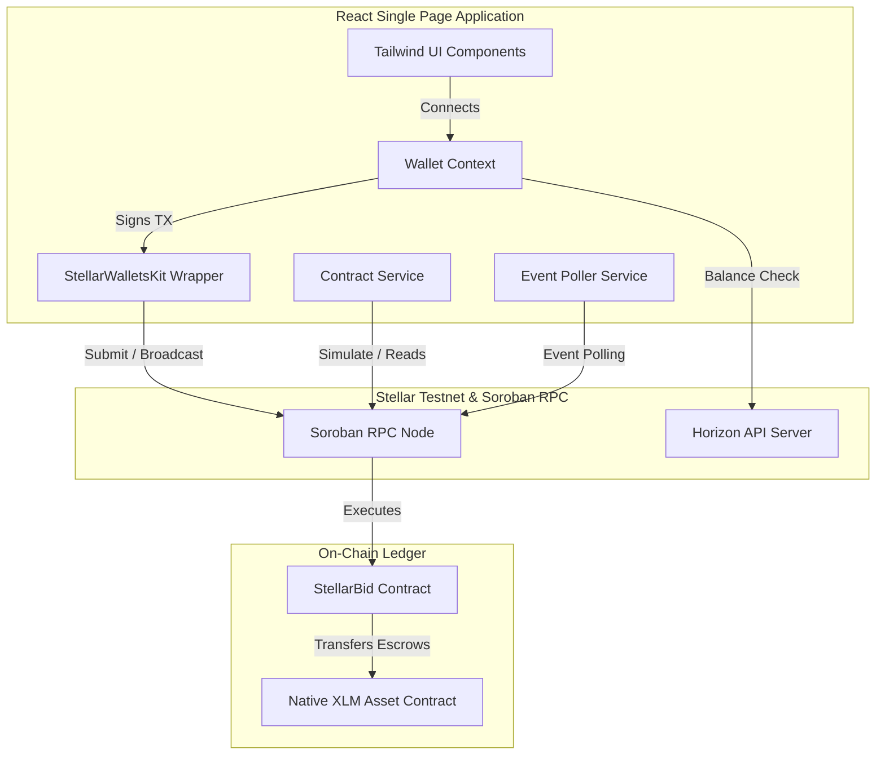
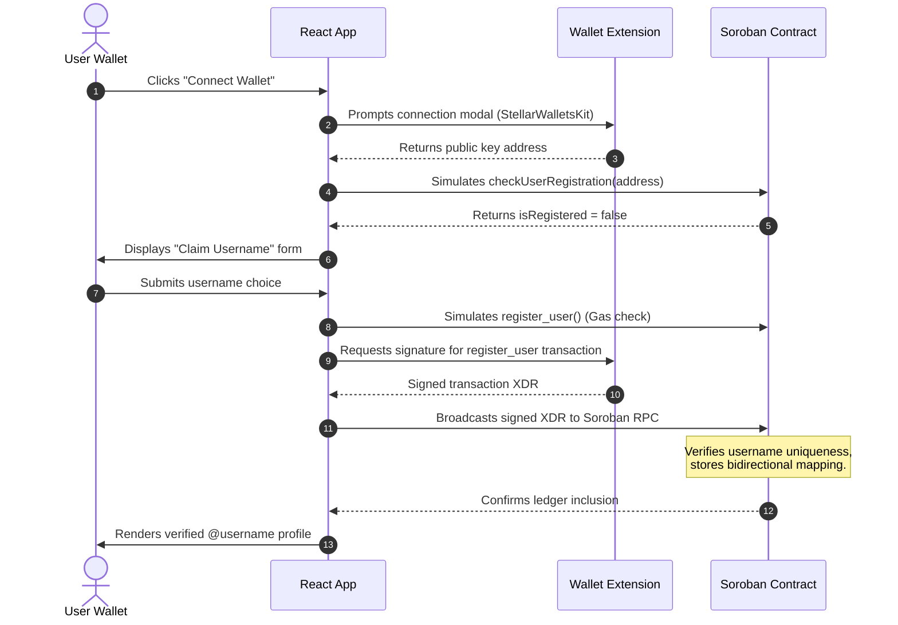
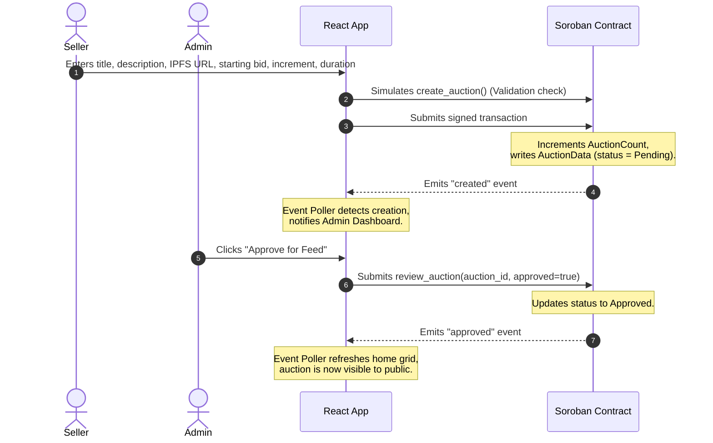
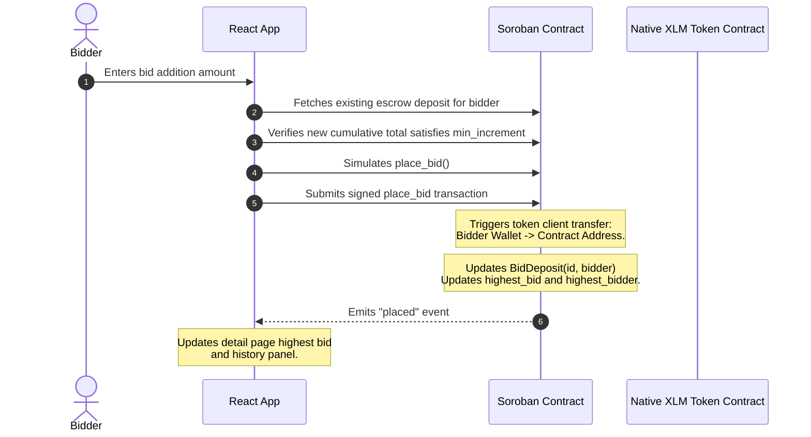
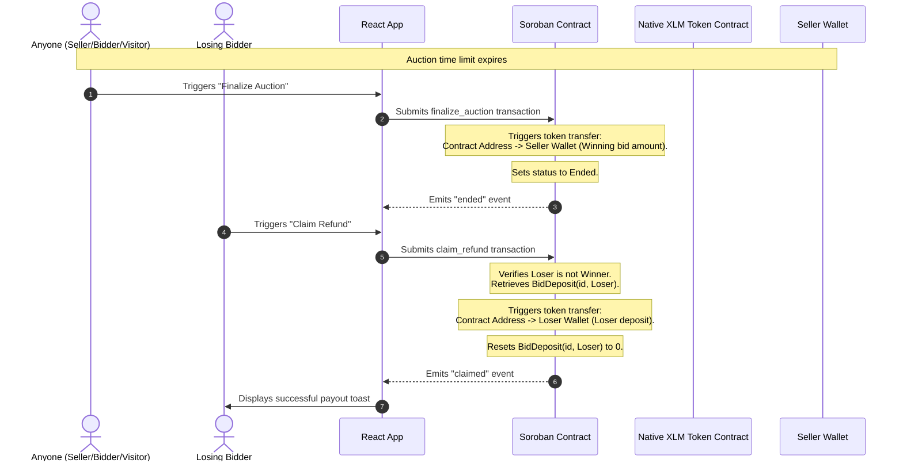

# StellarBid System Architecture & Technical Specifications

This document provides a comprehensive, low-level technical explanation of the **StellarBid** system. It describes the smart contract architecture, frontend configuration, state management, real-time sync systems, and the end-to-end transaction lifecycles.

---

## 1. High-Level System Architecture

StellarBid is divided into two primary subsystems:
1. **On-Chain Layer (Stellar Soroban)**: Written in Rust, compiled to WebAssembly (WASM), and deployed to Stellar Testnet. It acts as the single source of truth for identities, auctions, bids, and financial escrows.
2. **Off-Chain Layer (React Single Page App)**: Built with TypeScript and Vite. It wraps wallet interactions, polls for contract events, simulates transactions to prevent fee waste, and provides a dark-themed visual dashboard.



---

## 2. On-Chain Smart Contract Architecture (Soroban / Rust)

The contract lives in `contracts/auction/` and is designed under a strict `#![no_std]` environment to minimize WASM file size. It comprises five core source files:

### A. Storage Key Strategy (`src/storage.rs`)
To prevent unbounded storage costs and ledger bloat, the contract uses structured key-value storage. Unbounded vectors (such as lists of all auctions or all bidders) are avoided. Instead, sequential integer IDs and compound keys are used:

- **Instance Storage** (loaded on every call, cheap):
  - `Admin`: The `Address` of the admin reviewer/reviewer wallet.
  - `TokenId`: The contract `Address` of the native XLM Stellar Asset Contract (SAC).
  - `AuctionCount`: A `u64` incrementing counter representing the total number of auctions created.
- **Persistent Storage** (survives indefinitely, charged per-byte):
  - `Username(Address)`: Maps a wallet `Address` to its registered `String` username.
  - `UsernameExists(String)`: Maps a `String` username to its owning `Address` (enforces global uniqueness).
  - `Auction(u64)`: Maps an auction numeric ID to its `AuctionData` struct.
  - `BidDeposit(u64, Address)`: Maps a compound key of `(auction_id, bidder_address)` to the bidder's total cumulative XLM deposit in stroops (`i128`).

### B. Core Data Types (`src/types.rs`)
1. **`AuctionStatus` (Enum)**:
   - `Pending`: Newly submitted, waiting for admin approval.
   - `Approved`: Reviewer-approved; public bidding is open.
   - `Rejected`: Reviewer-rejected; hidden from public feeds.
   - `Ended`: End timestamp passed and finalized.
2. **`AuctionData` (Struct)**:
   - `id`: `u64` unique identifier.
   - `creator`: `Address` of the seller.
   - `title`, `description`, `media_url`: `String` values.
   - `starting_bid`, `min_increment`: `i128` values in stroops (1 XLM = 10,000,000 stroops).
   - `end_time`: `u64` Unix timestamp representing expiration.
   - `status`: `AuctionStatus` enum value.
   - `highest_bid`: `i128` representing the highest active bid.
   - `highest_bidder`: `Address` of the current leading bidder.
   - `total_bids`: `u32` bid counter.

### C. Function Execution Logic (`src/lib.rs`)

#### 1. `initialize(env: Env, admin: Address, token_id: Address)`
- Checks if `Admin` key already exists in instance storage. If so, returns `AlreadyInitialized`.
- Stores the admin wallet address, native token contract address, and sets the `AuctionCount` to 0.

#### 2. `register_user(env: Env, user: Address, username: String)`
- Asserts wallet signature via `user.require_auth()`.
- Validates username length is between 3 and 20 characters.
- Checks if the user already has a registered username (`UserAlreadyRegistered`).
- Checks if the desired username is already claimed (`UsernameAlreadyClaimed`).
- Stores bidirectional entries: `Username(user) -> username` and `UsernameExists(username) -> user`.

#### 3. `create_auction(env: Env, creator: Address, title: String, description: String, media_url: String, starting_bid: i128, min_increment: i128, end_time: u64)`
- Authenticates the creator.
- Verifies that the creator is a registered user.
- Verifies that `end_time` is in the future relative to `env.ledger().timestamp()`.
- Increments the global `AuctionCount`, instantiates a new `AuctionData` (status: `Pending`), and writes it to persistent storage.

#### 4. `review_auction(env: Env, admin: Address, auction_id: u64, approved: bool)`
- Authenticates the caller.
- Asserts that the caller is the registered `Admin` address.
- Fetches the auction. Verifies status is `Pending`.
- Updates status to `Approved` or `Rejected` based on the reviewer's choice and writes the update back.

#### 5. `place_bid(env: Env, bidder: Address, auction_id: u64, amount: i128)`
- Authenticates the bidder.
- Asserts that the auction is in `Approved` status and the current time is less than `end_time`.
- Asserts that the bidder is not the auction creator.
- Fetches the bidder's existing cumulative deposit from storage (defaults to 0).
- Calculates the new target total: `new_total = existing_deposit + amount`.
- **Validation**:
  - If it's the first bid (`total_bids == 0`): Asserts `new_total >= starting_bid`.
  - If bids exist: Asserts `new_total >= highest_bid + min_increment`.
- Invokes the Native Token Client to transfer `amount` from the bidder to the contract address.
- Updates the bidder's persistent `BidDeposit` key to `new_total`.
- Updates the auction's `highest_bid`, `highest_bidder`, and increments `total_bids`.

#### 6. `finalize_auction(env: Env, caller: Address, auction_id: u64)`
- Authenticates the caller (any user can trigger finalization to ensure trustless operations).
- Verifies that `current_time >= end_time` and status is `Approved`.
- If bids were placed, calls the token contract to transfer the winning `highest_bid` amount from the contract escrow to the auction creator.
- Sets status to `Ended`.

#### 7. `claim_refund(env: Env, bidder: Address, auction_id: u64)`
- Authenticates the bidder.
- Verifies that the auction is finalized (status is `Ended`).
- Asserts that the bidder is not the winning `highest_bidder`.
- Retrieves the bidder's `BidDeposit` total. If greater than 0, transfers that exact amount back to the bidder's wallet and zeros out their on-chain deposit entry.

---

## 3. Off-Chain Frontend Architecture (React / TS)

The React client sits in the `frontend/` directory, employing a design pattern centered on services, custom React hooks, and context providers.

### A. Context Providers & State Architecture
- **`WalletContext.tsx`**:
  - Initializes and exposes the `StellarWalletsKit` instance.
  - Exposes the connected account's public key address, native XLM balance (fetched from Horizon Testnet), registration status (`isRegistered`), and administrative authority indicator (`isAdmin`).
  - Listens to account change events from the wallet extension to dynamically update application contexts.
- **`ToastContext.tsx`**:
  - Manages overlays displaying transaction progress states (`SIMULATING` → `SIGNING` → `SUBMITTING` → `PENDING` → `SUCCESS`/`FAILED`).
  - Maps numeric Soroban contract error codes to friendly, human-readable notifications.

### B. Dynamic Soroban Event Polling (`src/services/events.ts`)
To emulate real-time behavior without page reloads, a custom polling service (`EventPoller`) runs in the background:
- Maintains a ledger pointer cursor (`lastLedger`) initialized to the current testnet ledger sequence minus a small buffer.
- Every 4 seconds, triggers `getEvents` on the Soroban RPC node filtering by the `CONTRACT_ID`.
- Parses the second event topic value (`ev.topic[1]`) using `scValToNative` to identify the action (e.g., `placed`, `created`, `approved`).
- Dispatches event payloads to registered frontend callbacks, causing pages to reload their state dynamically when bids are placed or approved.

---

## 4. End-to-End System Lifecycles

### A. User Registration & Username Claiming



### B. Creating and Approving Auctions



### C. Bidding and Escrow Lifecycle



### D. Finalization and Refund Lifecycle



---

## 5. Media Asset Resolving (IPFS Integration)

To support trustless content presentation while preserving on-chain resource constraints, StellarBid stores only decentralized content identifiers (CID) or links on-chain:

1. **Upload / Paste**: Users upload assets to IPFS via pinning providers (e.g., Pinata, Web3.Storage) and paste the URI (e.g., `ipfs://QmXoypizjW3Wkn2Resm1GalkHQmsjaQnvX54`) or use direct URL gateways when creating an auction.
2. **On-Chain Storage**: The contract saves the link string in the `media_url` field of `AuctionData`.
3. **Frontend Rendering**:
   When rendering an auction card or detail view, the frontend passes `media_url` through the `resolveIpfsUrl` utility:
   ```typescript
   export function resolveIpfsUrl(url: string): string {
     if (!url) return 'https://placehold.co/600x400/121420/8b5cf6?text=No+Media';
     if (url.startsWith('ipfs://')) {
       const hash = url.replace('ipfs://', '');
       return `https://ipfs.io/ipfs/${hash}`;
     }
     return url;
   }
   ```
   This transparently translates decentralized IPFS protocol links into HTTP-accessible gateway URLs, loading the image or video assets seamlessly in standard HTML tags (``, `<video>`).
